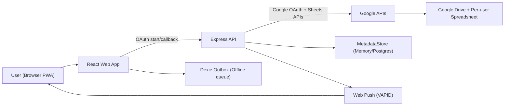

# Personal Care PWA - Low Level Design (LLD)

## 1) Scope
This document describes the current implementation of the Personal Care app and where to customize it safely.

- Frontend: React + Vite + TypeScript + Tailwind
- Backend: Node.js + Express + TypeScript
- Primary user data: Google Sheets (per-user spreadsheet)
- Metadata/session/push: MetadataStore (MemoryStore or PostgresStore)
- Auth: Google OAuth + JWT cookie session
- Offline/PWA: Service worker + Dexie outbox queue

## 2) Monorepo Layout

```text
apps/
  api/      # Express backend
  web/      # React frontend
packages/
  shared-types/  # shared TS types + health calculations
docs/
```

Key files:
- API bootstrap: `apps/api/src/app.ts`
- Web bootstrap: `apps/web/src/main.tsx`
- Main web orchestration: `apps/web/src/App.tsx`

## 3) Runtime Architecture



## 4) Data Model

### 4.1 MetadataStore (`users`, `push_subscriptions`)
`users` fields (logical):
- `userId`, `googleSub`, `email`, `name`
- `spreadsheetId`
- `encryptedRefreshToken`
- `timezone`
- `settingsJson` (now includes weekly check-in config)
- `createdAt`, `updatedAt`

`settingsJson` current shape:
```json
{
  "weeklyCheckinDay": "monday",
  "strictWeeklyCheckin": true
}
```

### 4.2 Google Sheets Tabs
One spreadsheet per user with tabs:
- `Profile`, `Goals`, `FoodLog`, `WaterLog`, `WeightLog`
- `RunLog`, `RunLaps`, `WorkoutPlans`, `WorkoutSessions`
- `BodyMetrics`, `Habits`, `HabitCompletions`
- `Reminders`, `Scores`, `Streaks`, `Audit`

Base columns on all tabs:
- `entry_id`, `user_id`, `local_date`, `created_at`, `updated_at`

## 5) Backend Design

### 5.1 App Composition
`createApp()` wires:
- CORS, JSON parser, cookie parser
- Route modules
- Global error middleware

### 5.2 Route Modules and Responsibilities

#### Auth (`/auth/*`)
- `GET /auth/google/start`
- `GET /auth/google/callback`
- `POST /auth/logout`

Responsibilities:
- OAuth code exchange
- user upsert in metadata store
- spreadsheet ensure/create
- session cookie issue/clear

#### Me (`/me`)
- `GET /me` (auth required)

#### Diet (`/diet/*`)
- `GET/POST /diet/foods`
- `GET/POST /diet/water`
- `GET/POST /diet/weight`
- `GET /diet/summary`

Responsibilities:
- Food/water/weight logging
- OpenFoodFacts search
- TDEE/target calorie summary + safety warnings

#### Exercise (`/exercise/*`)
- `GET/POST /exercise/runs`
- `GET/POST /exercise/runs/:id/laps`
- `GET/POST /exercise/workouts`
- `POST /exercise/workouts/:id/complete`

Responsibilities:
- Run and lap persistence
- Starter workout seeding
- Auto-progress workout week when target sessions reached

#### Habits + Metrics (`/habits/*`, `/metrics/body`)
- `GET/POST /habits`
- `POST /habits/:id/check`
- `GET /metrics/body`
- `POST /metrics/body`

Responsibilities:
- Starter habit seeding
- Habit completion logging
- Weekly body metrics logging
- Strict weekly check-in day enforcement (`409` on violations)

#### Profile (`/profile/*`)
- `GET /profile/scoreboard`
- `GET /profile/streaks`
- `GET/POST /profile/settings`
- `GET /profile/weekly-insights`
- `GET /profile/coach-insights`

Responsibilities:
- Gamification summaries
- Weekly consistency/adherence/improvement insights
- Predictive coaching outputs
- Persisting user settings for check-in rules

#### Reminders + Push
- `GET/POST /reminders`
- `POST /push/subscribe`
- `POST /jobs/reminders/run`

Responsibilities:
- Reminder CRUD-lite
- Push subscription persistence
- Cron-triggered reminder dispatch
- End-of-day streak resolution

### 5.3 Core Services
- `SheetsService`: tab/header ensure, row list/append
- `GamificationService`: score events, streak state transitions
- `WeeklyCheckinService`: parse/validate settings + check-in gate logic
- `ProfileInsightsService`: weekly insights + predictive coach model
- `openFoodFacts`: external calorie lookup

## 6) Frontend Design

### 6.1 App Shell
`App.tsx` handles:
- Session bootstrap (`/me` + dashboard data loads)
- Mutation handlers (POST calls)
- Offline sync trigger
- Tab navigation + shared status banner

### 6.2 Section Components
Located in `apps/web/src/components/sections`:
- `DashboardSection`
- `DietSection`
- `ExerciseSection`
- `RoutineSection`
- `ProfileSection`

Shared UI atoms:
- `components/ui/Card.tsx`
- `components/ui/ProgressMeter.tsx`

Shared web types:
- `apps/web/src/types/app.ts`

### 6.3 Offline/PWA
- Service worker: `apps/web/public/sw.js`
- IndexedDB outbox: `apps/web/src/lib/offlineDb.ts`
- API wrapper: `apps/web/src/lib/api.ts`
  - Queues offline writes
  - Does **not** queue 4xx validation/business-rule errors

### 6.4 Push
- Web registration: `apps/web/src/lib/push.ts`
- Uses VAPID public key (`VITE_VAPID_PUBLIC_KEY`)

## 7) Key Execution Flows

### 7.1 First Login
1. Web opens `/auth/google/start`.
2. Google callback returns code to API.
3. API exchanges code, stores encrypted refresh token, ensures sheet.
4. API sets `pc_session` cookie and redirects to web success page.
5. Web loads `/me` and dashboard datasets.

### 7.2 Weekly Body Check-in (Strict Mode)
1. User submits metrics from Profile.
2. API reads user settings from `settingsJson`.
3. API validates weekday + once-per-week rule.
4. If invalid: `409` with reason + next allowed date.
5. If valid: append to `BodyMetrics`, score event emitted.

### 7.3 Predictive Coach
1. Web calls `/profile/coach-insights`.
2. API loads run/weight/goal rows from sheets.
3. Service computes trend slope + 4-week projection + tips.
4. Web renders trend, forecast, confidence, tips.

## 8) Customization Guide

### 8.1 Change Weekly Check-in Rule
File: `apps/api/src/services/weeklyCheckinService.ts`
- `DEFAULT_APP_SETTINGS`
- `validateWeeklyCheckin()`

Customize:
- default day
- strict/flexible spacing logic
- response reason strings

### 8.2 Upgrade Predictive Analytics
File: `apps/api/src/services/profileInsightsService.ts`
- `buildCoachInsights()`
- `buildCoachingTips()`
- `regressionSlopeByDay()`

Customize:
- lookback window
- confidence scoring
- tips logic
- target ETA rules

### 8.3 Tune Gamification
Files:
- `packages/shared-types/src/index.ts` (scoring constants)
- `apps/api/src/services/gamificationService.ts`

Customize:
- points per event
- level progression thresholds
- streak reset policy

### 8.4 Modify Workout Progression
File: `apps/api/src/routes/exerciseRoutes.ts`

Customize:
- starter templates
- target session growth curve
- progression trigger condition

### 8.5 Add New Domain Feature
Recommended pattern:
1. Add sheet tab + headers in `SheetsService`.
2. Add route module with zod validation.
3. Add service module if logic is non-trivial.
4. Add web types + section component.
5. Add unit tests + one flow test.

## 9) Testing

Current automated coverage:
- Shared logic unit tests (`packages/shared-types`)
- API unit tests (`apps/api/test`)
- API flow test (`apps/api/test/e2eFlows.test.ts`) for settings/check-in/coach path

Recommended next:
- Browser E2E for OAuth/PWA/push (Playwright)

## 10) Environment and Deployment

API env:
- See `apps/api/.env.example`

Web env:
- See `apps/web/.env.example`

CI/CD:
- Workflows in `.github/workflows/`
- Deploy targets typically Vercel (web) + Render (api) + Neon (metadata DB)

## 11) Current Known Extension Gaps
1. Browser-level E2E (OAuth redirect + push notification delivery) is not yet automated.
2. Predictive coach is rule-based/regression-based, not model-driven personalization.
3. Some route modules can be further split into explicit controller/service/repository layers.

